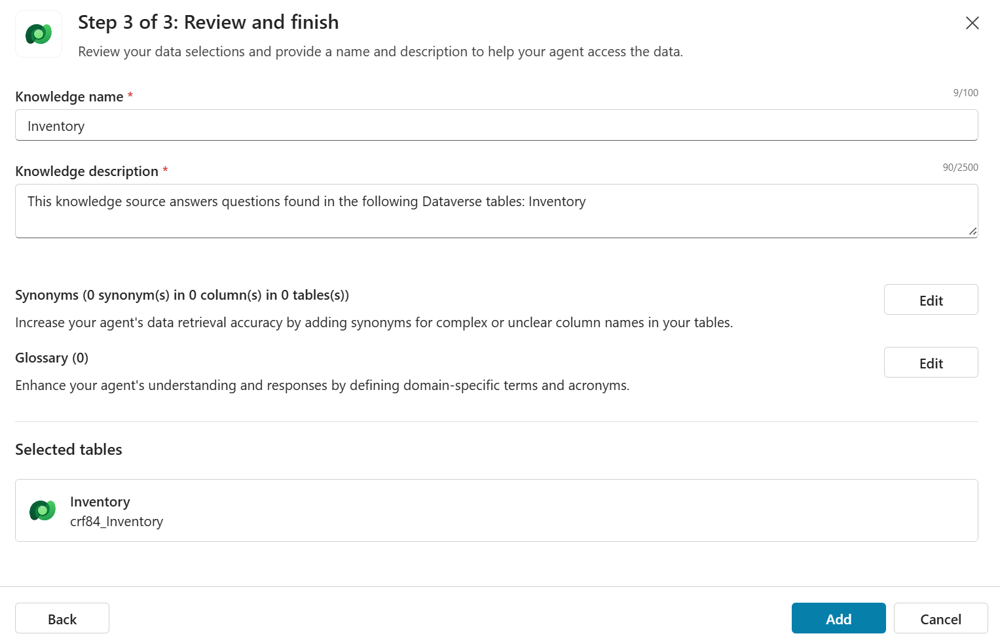

# Use Agent to Update Dataverse Table

## Introduction

Some time ago, I watched a demo of an AI agent updating a row in a table. The scenario was really simple, but was enough to show the capability of the tool and the potential for the users. Then, I started to thinking if it is possible to do the same using Copilot Studio. This article is to show how I used an agent to update information in a Dataverse table using the chatbot interface.

## Problem Statement

The Dataverse table Inventory contains the actual stock of materials, including stock threshold and unit of measure. The agent should be able to answer questions about the stock and also change the stock levels using natural language.

Example of questions and requests from the user:

- What is the stock of coffee?
- How much paper tower do I have in stock?
- Should I need to buy more soap?
- Add 2 more units of sugar.

In summary, the agent must be capable to answer questions about the actual stock, understand if it is necessary to purchase more material, and increase the stock per material.

## Solution

The solution is an agent created using Copilot Studio. The agent is using the new Copilot Studio feature [generative orchestration](https://learn.microsoft.com/en-us/microsoft-copilot-studio/advanced-generative-actions) to determine the best actions, knowledge, and topics to answer user queries or respond event triggers. The agent is composed by a knowledge, a topic, and a AI prompt.

The knowledge **Inventory** is responsible to connect to the Dataverse table that contains the inventory data. Since the columns names are self-explained, it is not necessary to add any synonyms or glossaries to the knowledge.

The topic **Update Inventory** will be triggered when the user asked some update action, like update inventory, add units etc. In the topic, the prompt action **Material information from Dataverse table** will extract relevant inventory information for the next node **Update Dataverse Inventory table**. It will call the action **Update inventory table** which will update the Dataverse table Inventory based on the inventory information extract by the prompt node.

The prompt action is the most critical element of the solution. Prompt actions are very powerful tool when you are creating the agent. You basically can invoke LLMs to do all sort of actions. In this case, the prompt action is being used to extract important data to update the inventory, like the Row ID.

## Solution breakdown

You can download the latest solution file from [this folder](../../solutions/InventoryControlDataverse/export/). Alternatively, you can recreate the solution based on the detail described on this section.

### Agent attributes

Agent with the following information:

```text
Name: Inventory Control
Description: An agent designed to manage the Inventory dataverse table, providing functionalities such as listing materials with stock below the threshold and checking stock positions for specific materials.
Instructions:
- Manage the Inventory dataverse table.
- Provide functionalities to list materials with stock below the threshold.
- Check stock positions for specific materials.
- Ensure accurate and up-to-date information.
- Respond promptly and efficiently to user queries.
- Avoid providing any financial, legal, or health advice.
- Maintain a professional and helpful tone.
```

### Knowledge

Knowledge are components the agents use to answer prompts based on information provided by the user. It could be documents or database tables. The following knowledge were created to access data from the Inventory table at Dataverse.

```text
Name: Inventory
Description: This knowledge source answers questions found in the following Dataverse tables: Inventory 
```



### Topics

The new topic is to manage the update flow. During the update, it is necessary to retrieve the Row ID and use the action to update Dataverse table.

```text
Name: Update Inventory 
Trigger by agent, based on the following description on what the topic does: This tool can handle queries like these: update inventory, inventory update, change stock levels, modify inventory, adjust product quantities, add units
```

#### Prompt action

The AI prompt **Material information from Dataverse table** is the key component. The prompt will extract relevant information from the user prompt and get the actual row information for the material. The AI prompt has the following attributes:

```prompt
Extract the material name, quantity added and unit of measure from the text  Add to the inventory . Use the material name to get Row ID from Inventory.Material Name. 
Answer using JSON format, using the following fields:
{  
"Material_Name": Inventory.Material Name  ,  
"Quantity_Added": quantity added,
"Quantity_in_Stock": Inventory.Quantity in Stock  ,  
"Unit_of_Measure":  Inventory.Unit of Measure ,  
"Row_Id": row id from Inventory table
}
You also need to add the quantity extracted from the text to the actual quantity in stock.
The unit of measure needs to be formatted as 1 for Unit and 2 for Box.
```

The expected output for this prompt is a JSON structure with relevant information to update the table in the next action.

```output
{
  "Material_Name": "Sugar",
  "Quantity_Added": 10,
  "Quantity_in_Stock": 28,
  "Unit_of_Measure": 1,
  "Row_Id": "485fa596-d4ab-471c-8452-30729a25f66d"
}
```


### Inventory table

The Inventory table resides in the Dataverse. It is a very simple table, created just for the purpose of the demo. Here is the content example:

| Material Name | Quantity | Unit of Measure | Stock Threshold |
| ------------- | :------: | :-------------: | :-------------: |
| Coffee        |    50    |      Unit       |       10        |
| Coffee filter |   100    |      Unit       |       20        |
| Paper tower   |   200    |      Unit       |       50        |
| Soap          |    2     |       Box       |        5        |
| Sugar         |    20    |      Unit       |       10        |

## Testing the agent

To test the agent, just prompt some questions using the test panel:

- How much sugar do I have in stock?
- The current stock level of sugar is 18 units
- Should I need to buy more sugar?
- You currently have 18 units of sugar in stock. Based on this quantity, you may need to consider purchasing more sugar if your demand exceeds this level
- Add 20 more units of sugar to the stock.
- The stock of sugar has been successfully updated by adding 20 more units.
- And not, do I have enough sugar in stock? How much sugar do I have in stock?
- You now have 38 units of sugar in stock. This should be sufficient to meet your inventory needs.


## Conclusion

The goal of this very simple agent is just to propose a solution enabling an agent to update a table. You can improve the agent adding more capabilities, such as, update the material description, update the threshold, decreasing the stock level, and even return a list of materials that should be purchases (stock level below the threshold).
